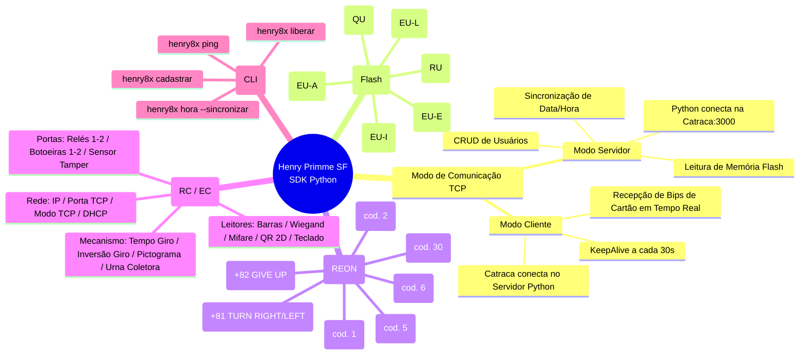

# Manual Máximo de Engenharia — Protocolo Henry Primme SF (Catracas e Controladores de Acesso)

[](https://www.python.org/)
[](https://opensource.org/licenses/MIT)
[](#)
[](#)

> **Autor:** estrelaex  
> **Equipamentos Cobertos:** Henry Primme SF (Catracas e Controladores de Acesso)  
> **Protocolo:** Protocolo Proprietário Henry Primme SF Acesso v8.0.0.50 (TCP/IP Sockets)  
> **Linguagem:** 100% Python 3 Nativo (Zero dependência de DLLs, .NET ou pacotes C#)

---

## ⚡ Uso Rápido via CLI (Linha de Comando)

Após instalar o pacote (`pip install git+https://github.com/estrelanegrax/henry-8x-python.git`), você pode interagir com o equipamento direto do terminal:

```bash
# 1. Testar conexão com a catraca
henry8x ping --ip 192.168.0.179

# 2. Liberar giro de entrada com mensagem customizada
henry8x liberar --ip 192.168.0.179 --sentido entrada --mensagem "BEM VINDO"

# 3. Sincronizar data e hora com o computador
henry8x hora --ip 192.168.0.179 --sincronizar

# 4. Cadastrar um usuário direto na memória Flash
henry8x cadastrar --ip 192.168.0.179 --id 1050 --nome "JOAO DA SILVA" --cartao 1050
```


---

## 🧠 Mapa Mental da Arquitetura e Recursos



---


### Módulo Base de Comunicação em Python

```python
# backend/henry_base.py
import socket
import time

def montar_pacote(cmd_txt: str) -> bytes:
    """Empacota uma string ASCII no protocolo binário Henry Primme SF."""
    payload = cmd_txt.encode('latin-1')
    tam = len(payload)
    b_lo = tam & 0xFF
    b_hi = (tam >> 8) & 0xFF
    chk = b_lo ^ b_hi
    for b in payload:
        chk ^= b
    return bytes([0x02, b_lo, b_hi]) + payload + bytes([chk, 0x03])


def enviar_comando_henry(ip: str, port: int = 3000, cmd_txt: str = "", timeout: float = 4.0) -> tuple:
    """Abre conexão TCP, envia o pacote formatado e retorna a resposta pura."""
    pacote = montar_pacote(cmd_txt)
    try:
        s = socket.socket(socket.AF_INET, socket.SOCK_STREAM)
        s.settimeout(timeout)
        s.connect((ip, port))
        s.sendall(pacote)

        buf = b""
        t0 = time.time()
        while time.time() - t0 < 1.2:
            try:
                chunk = s.recv(16384)
                if chunk:
                    buf += chunk
                    t0 = time.time()
                else:
                    break
            except socket.timeout:
                break

        s.close()
        # Remove STX, TAM, CHK e ETX
        payload_resp = buf[3:-2].decode('latin-1', 'ignore') if len(buf) >= 5 else buf.decode('latin-1', 'ignore')
        return True, payload_resp
    except Exception as e:
        return False, str(e)
```

---

# PARTE 2: Gerenciamento de Usuários (CRUD Memória Flash)

---

## 2.1 `EU` (Operação `I`) — Inserir / Cadastrar Usuário

### 🎯 Propósito
Grava um novo cadastro contendo Matrícula/ID, Nome do Usuário e Número do Cartão RFID/Código de Barras na memória Flash interna da catraca ou controlador.

### 🏢 Aplicação por Tipo de Equipamento
- **Catraca (Primme SF):** Suportado. Libera o giro quando o cartão for aproximado.
- **Controlador de Acesso (Porta):** Suportado. Aciona o relé da porta quando o cartão for aproximado.

### 📤 Pacote Enviado
- **Comando ASCII:** `01+EU+00+1+I[1050[JOAO DA SILVA[[1[1050`
- **Hex Dump Bruto Enviado:**
  ```hex
  02 27 00 30 31 2B 45 55 2B 30 30 2B 31 2B 49 5B 31 30 35 30 5B 43 41 52 4C 4F 53 20 41 4C 42 45 52 54 4F 5B 5B 31 5B 31 30 35 30 4E 03
  ```

### 📥 Resposta em SUCESSO
```http
01+EU+000+1+0
```
- `01`: Número do equipamento
- `+EU+`: Comando de confirmação de usuários
- `000`: Sem erros no pacote
- `1+0`: 1 registro processado, status `0` (Sucesso).

### ❌ Resposta em ERRO
```http
01+EU+000+1+22
```
- `22`: Usuário ou Cartão já cadastrado na memória ou em conflito.

### 💻 Código Python Dedicado
```python
def henry_inserir_usuario(ip: str, port: int, user_id: str, nome: str, cartao: str) -> tuple:
    cmd = f"01+EU+00+1+I[{user_id}[{nome[:32]}[[1[{cartao}"
    ok, resp = enviar_comando_henry(ip, port, cmd)
    sucesso = ok and ("+EU+000+1+0" in resp or "+EU+00" in resp and not "00]22" in resp)
    return sucesso, resp
```

---

## 2.2 `EU` (Operação `A`) — Alterar Usuário

### 🎯 Propósito
Atualiza o Nome ou Cartão de uma pessoa que já está previamente cadastrada na memória.

### 📤 Pacote Enviado
- **Comando ASCII:** `01+EU+00+1+A[1050[JOAO DA SILVA[[1[1050`

### 📥 Resposta em SUCESSO
```http
01+EU+000+1+0
```

### ❌ Resposta em ERRO
```http
01+EU+000+1+22
```
- `22`: ID de usuário não encontrado para alteração.

---

## 2.3 `EU` (Operação `E`) — Remover Usuário

### 🎯 Propósito
Exclui o cadastro de um usuário da memória da catraca pelo seu ID/Matrícula.

### 📤 Pacote Enviado
- **Comando ASCII:** `01+EU+00+1+E[1050`

### 📥 Resposta em SUCESSO
```http
01+EU+000+1+12
```
- `12`: Código de confirmação de exclusão executada.

---

## 2.4 `EU` (Operação `L`) — Limpar Memória Flash

### 🎯 Propósito
Apaga **100% dos cadastros de usuários** salvos na memória Flash da catraca.

### 📤 Pacote Enviado
- **Comando ASCII:** `01+EU+00+1+L[`

### 📥 Resposta em SUCESSO
```http
01+EU+000+1+0
```

---

## 2.5 `RU` — Listar Usuários em Blocos

### 🎯 Propósito
Lê sequencialmente a tabela de usuários gravada na memória Flash.

### 📤 Pacote Enviado
- **Comando ASCII:** `01+RU+00+10]0` *(Lê 10 registros a partir do offset 0)*

### 📥 Resposta em SUCESSO
```http
01+RU+000+10+00000000004510994730[USUARIO TESTE 01[[1[00000000004510994730]...
```

---

## 2.6 `QU` — Consultar Quantidade de Usuários

### 📤 Pacote Enviado: `01+QU+00`
### 📥 Resposta em SUCESSO: `01+QU+0120=`

---

# PARTE 3: Liberação Remota e Eventos Online (`REON`)

---

## 3.1 `REON` (Código `5`) — Liberar Giro de Entrada (EXCLUSIVO CATRACA)

### 📤 Pacote Enviado
- **Comando ASCII:** `01+REON+00+5]5]Acesso Liberado}Seja Bem Vindo]1`

### 📥 Resposta em SUCESSO
```http
01+REON+000+80]]26/07/2026 15:00:00]0]0]0
```

---

## 3.2 `REON` (Código `6`) — Liberar Giro de Saída (EXCLUSIVO CATRACA)

### 📤 Pacote Enviado
- **Comando ASCII:** `01+REON+00+6]5]Saida Liberada}Ate Logo]1`

---

## 3.3 `REON` (Código `1`) — Liberar Porta / Relé (EXCLUSIVO CONTROLADOR DE ACESSO)

### 📤 Pacote Enviado
- **Comando ASCII:** `01+REON+00+1]4]Porta Liberada}estrelaex]1`

---

## 3.4 Confirmação de Giro Físico (`+REON+000+81` / `82`) (EXCLUSIVO CATRACA)

- **`+REON+000+81` (Giro Realizado):** A pessoa girou o braço (`TURN RIGHT` / `LEFT`).
- **`+REON+000+82` (Desistência):** A pessoa desistiu ou o tempo limite expirou (`GIVE UP`).

---

# PARTE 4: Data, Hora e Relógio

- **`RH` (Ler Horário):** `01+RH+00` → Retorna `01+RH+000+26/07/26 15:30:00]00/00/00]00/00/00`
- **`EH` (Ajustar Horário):** `01+EH+00+26/07/26 15:30:00]]` → Retorna `01+EH+000`

---

# PARTE 5: Status, Diagnósticos e Quantidades (`RQ`)

- **`01+RQ+00+U`**: Qtd Usuários (`01+RQ+000+U]120`)
- **`01+RQ+00+D`**: Qtd Digitais (`01+RQ+000+D]45`)
- **`01+RQ+00+R`**: Total Eventos (`01+RQ+000+R]60431`)
- **`01+RQ+00+RNC`**: Eventos Pendentes (`01+RQ+000+RNC]150`)
- **`01+RQ+00+TP`**: Bloqueio Catraca (`01+RQ+000+TP]D`)

---

# PARTE 6: Configurações do Equipamento (`RC` / `EC`)

- **`RC` (Ler Configurações):** `01+RC+00+IP]PORTA_TCP]MODE]EXP_TEMPO_LIBERACAO`
- **`EC` (Alterar Parâmetros):** `01+EC+00+EXP_TEMPO_LIBERACAO[8]`

---

# PARTE 7: Mensagens Fixas do Display (`EMSG` / `RMSG`)

- **`EMSG` (Enviar Mensagens Standby):** `01+EMSG+00+3[[0[[2[BEM VINDO[5[`
- **`RMSG` (Ler Mensagens Standby):** `01+RMSG+00`

---

# PARTE 8: Acionamento de Sirene / Agendamento (`EACI` / `RACI`)

- **`EACI` (Programar Sirene):** `01+EACI+00+1+I[10[Sinal Escola[07:30:00[1[5[12345`
- **`RACI` (Ler Horários):** `01+RACI+00+1]0`

---

# PARTE 9: Biometria e Digitais (`RD` / `ED`)

- **`RD` (Baixar Digitais):** `01+RD+00+10]0`
- **`ED` (Enviar Digitais):** `01+ED+00+1+I[1050[TEMPLATE_HEX`

---

# PARTE 10: Autenticação e Criptografia (`RA` / `EA`)

- **`RA` (Chave Pública RSA):** `01+RA+00`
- **`EA` (Autenticar WebAdmin):** `01+EA+00+primmesf]121314]`

---

# PARTE 11: Tabela de Códigos de Retorno e Diagnóstico

| Código | Significado | Causa Comum |
|--------|-------------|-------------|
| **`000` / `0`** | **Sucesso Total** | Comando executado com sucesso |
| **`004`** | **Não Autorizado** | Nível de acesso ou senha incorreta |
| **`010`** | **Sintaxe Incorreta** | Falha na formatação ASCII |
| **`012`** | **Parâmetro Fora de Faixa** | Formato de data/hora ou valor inválido |
| **`013`** | **Comando Inexistente** | Código de comando não reconhecido |
| **`021`** | **Tabela Vazia** | Nenhum registro encontrado |
| **`022`** | **Registro Não Encontrado** | Usuário/Cartão não cadastrado ou duplicado |

---

# PARTE 12: Exemplo Prático 1 — Servidor TCP Online em Tempo Real (Catraca vs Controlador)

Este script demonstra como montar um **Servidor TCP completo em tempo real** que fica escutando bips de cartão, valida regras de acesso, diferencia Catracas de Controladores de Porta e monitora confirmações de giro com KeepAlive.

```python
#!/usr/bin/env python3
# -*- coding: utf-8 -*-
"""
═══════════════════════════════════════════════════════════════════════════════
   EXEMPLO 1: SERVIDOR TCP ONLINE EM TEMPO REAL (CATRACA & CONTROLADOR DE PORTA)
═══════════════════════════════════════════════════════════════════════════════
"""

import socket
import threading
import time
from datetime import datetime

# Simulação de Banco de Dados de Usuários Cadastrados
USUARIOS_PERMITIDOS = {
    "4510994730": {"nome": "USUARIO TESTE 01", "tipo": "ALUNO", "status": "ATIVO"},
    "4510994731": {"nome": "USUARIO TESTE 02", "tipo": "FUNCIONARIO", "status": "ATIVO"},
    "4510994739": {"nome": "USUARIO TESTE 03",  "tipo": "VISITANTE",   "status": "ATIVO"}
}

def montar_pacote(cmd_txt: str) -> bytes:
    payload = cmd_txt.encode('latin-1')
    tam = len(payload)
    b_lo = tam & 0xFF
    b_hi = (tam >> 8) & 0xFF
    chk = b_lo ^ b_hi
    for b in payload: chk ^= b
    return bytes([0x02, b_lo, b_hi]) + payload + bytes([chk, 0x03])


def extrair_payload(raw: bytes) -> str:
    if len(raw) >= 5:
        return raw[3:-2].decode('latin-1', 'ignore')
    return raw.decode('latin-1', 'ignore')


def tratar_conexao_equipamento(conn: socket.socket, addr: tuple, eh_catraca: bool = True):
    print(f"\n[SERVIDO ONLINE] Equipamento conectado: {addr[0]}:{addr[1]} | Tipo: {'CATRACA' if eh_catraca else 'PORTA'}")
    conn.settimeout(30.0)
    last_keepalive = time.time()

    try:
        while True:
            # 1. Heartbeat KeepAlive a cada 30 segundos
            if time.time() - last_keepalive > 30.0:
                try:
                    conn.sendall(montar_pacote("01+RH+00"))
                    last_keepalive = time.time()
                except Exception as e:
                    print(f"[SERVIDOR] Erro no KeepAlive {addr[0]}: {e}")
                    break

            # 2. Recebimento de Dados
            try:
                dados = conn.recv(4096)
                if not dados:
                    break
            except socket.timeout:
                continue

            payload = extrair_payload(dados)
            print(f"[RECEPTOR {addr[0]}] Payload: {payload}")

            # 3. Interceptação do Bip do Cartão (+REON+000+0)
            if "+REON+000+0" in payload:
                # Exemplo de Payload: 01+REON+00+5]4510994730]26/07/2026 15:00:00]1]0]5
                partes = payload.split(']')
                cartao = partes[1].lstrip('0') if len(partes) > 1 else ""

                print(f"[BIP DETECTADO] Cartão Lido: {cartao}")

                if cartao in USUARIOS_PERMITIDOS:
                    usr = USUARIOS_PERMITIDOS[cartao]
                    print(f" -> ACESSO LIBERADO: {usr['nome']} ({usr['tipo']})")

                    if eh_catraca:
                        # CATRACA: Libera giro de Entrada (cod. 5) e aguarda confirmação de giro físico (+REON+000+81)
                        resp_cmd = f"01+REON+00+5]5]Acesso Liberado}Seja Bem-vindo]1"
                    else:
                        # CONTROLADOR DE PORTA: Aciona Relé 1 (cod. 1) por 4s sem aguardar giro
                        resp_cmd = f"01+REON+00+1]4]Porta Liberada}estrelaex]1"

                    conn.sendall(montar_pacote(resp_cmd))
                else:
                    print(f" -> ACESSO NEGADO: Cartão {cartao} não cadastrado!")
                    resp_cmd = "01+REON+00+30]6]Nao Cadastrado}}}]"
                    conn.sendall(montar_pacote(resp_cmd))

            # 4. Confirmação de Giro Físico (Exclusivo Catraca)
            elif "+REON+000+81" in payload:
                print(f" [CONFIRMAÇÃO DE GIRO] O usuário girou a catraca e passou com sucesso! (TURN RIGHT)")
            elif "+REON+000+82" in payload:
                print(f" [DESISTÊNCIA] O usuário encostou o cartão mas NÃO girou a catraca! (GIVE UP)")

    finally:
        conn.close()
        print(f"[SERVIDO ONLINE] Equipamento desconectado: {addr[0]}")


def iniciar_servidor_online(host="0.0.0.0", port=3000):
    server = socket.socket(socket.AF_INET, socket.SOCK_STREAM)
    server.setsockopt(socket.SOL_SOCKET, socket.SO_REUSEADDR, 1)
    server.bind((host, port))
    server.listen(10)
    print(f"[SERVIDO ONLINE] Escutando catracas e controladores em {host}:{port}...")

    try:
        while True:
            conn, addr = server.accept()
            # Inicia Thread dedicada para cada catraca/porta conectada
            t = threading.Thread(target=tratar_conexao_equipamento, args=(conn, addr, True), daemon=True)
            t.start()
    except KeyboardInterrupt:
        print("[SERVIDOR] Encerrando servidor...")
    finally:
        server.close()


if __name__ == "__main__":
    # Para rodar o servidor online em tempo real:
    # iniciar_servidor_online()
    pass
```

---

# PARTE 13: Exemplo Prático 2 — Operação em Modo Offline (Carga / Push de Dados)

Este script demonstra como realizar uma **Carga de Dados (Push)** para enviar a lista de usuários, cartões e horário diretamente para a memória Flash do equipamento, permitindo que a catraca ou porta funcione **100% autônoma offline**, mesmo se o computador ou a rede caírem.

```python
#!/usr/bin/env python3
# -*- coding: utf-8 -*-
"""
═══════════════════════════════════════════════════════════════════════════════
   EXEMPLO 2: OPERAÇÃO EM MODO OFFLINE (CARGA / PUSH DE DADOS NA MEMÓRIA)
═══════════════════════════════════════════════════════════════════════════════
"""

import socket
import time
from datetime import datetime

# Lista de cadastros a serem enviados para a memória Flash da Catraca/Porta
LISTA_USUARIOS_BANCO = [
    {"id": "1001", "nome": "USUARIO TESTE 01", "cartao": "4510994730"},
    {"id": "1002", "nome": "USUARIO TESTE 02", "cartao": "4510994731"},
    {"id": "1003", "nome": "USUARIO TESTE 03",  "cartao": "4510994739"},
    {"id": "1004", "nome": "USUARIO TESTE 04",     "cartao": "4510994743"},
]

HENRY_IP   = "192.168.0.179"
HENRY_PORT = 3000

def montar_pacote(cmd_txt: str) -> bytes:
    payload = cmd_txt.encode('latin-1')
    tam = len(payload)
    b_lo = tam & 0xFF
    b_hi = (tam >> 8) & 0xFF
    chk = b_lo ^ b_hi
    for b in payload: chk ^= b
    return bytes([0x02, b_lo, b_hi]) + payload + bytes([chk, 0x03])


def enviar_cmd(cmd_txt: str) -> str:
    s = socket.socket(socket.AF_INET, socket.SOCK_STREAM)
    s.settimeout(4.0)
    s.connect((HENRY_IP, HENRY_PORT))
    s.sendall(montar_pacote(cmd_txt))
    buf = s.recv(4096)
    s.close()
    return buf[3:-2].decode('latin-1', 'ignore') if len(buf) >= 5 else buf.decode('latin-1', 'ignore')


def executar_carga_offline():
    print("=" * 75)
    print(f"  INICIANDO CARGA DE DADOS PARA OPERAÇÃO OFFLINE EM {HENRY_IP}:{HENRY_PORT}")
    print("=" * 75)

    # 1. Sincroniza Data e Hora no Relógio Interno
    agora_str = datetime.now().strftime("%d/%m/%y %H:%M:%S")
    cmd_hora = f"01+EH+00+{agora_str}]]"
    resp_hora = enviar_cmd(cmd_hora)
    print(f" [1/4] Sincronizando Data/Hora ({agora_str})... Resposta: {resp_hora}")

    # 2. Limpa a Memória Flash de Usuários (Opcional - garante carga limpa)
    resp_limpeza = enviar_cmd("01+EU+00+1+L[")
    print(f" [2/4] Limpando Memória Flash de Usuários... Resposta: {resp_limpeza}")
    time.sleep(1)

    # 3. Envia cada usuário da lista do Banco de Dados para a Memória Flash da Catraca
    print(f" [3/4] Enviando {len(LISTA_USUARIOS_BANCO)} usuários para a memória Flash...")
    for idx, usr in enumerate(LISTA_USUARIOS_BANCO, start=1):
        # Formato oficial: 01+EU+00+1+I[ID[NOME[[1[CARTAO
        cmd_user = f"01+EU+00+1+I[{usr['id']}[{usr['nome'][:32]}[[1[{usr['cartao']}"
        resp_usr = enviar_cmd(cmd_user)
        ok = "+EU+000+1+0" in resp_usr or "+EU+00" in resp_usr
        status_txt = "SUCESSO" if ok else f"FALHA ({resp_usr})"
        print(f"       ({idx:02d}/{len(LISTA_USUARIOS_BANCO)}) {usr['id']} - {usr['nome']:<25} -> {status_txt}")

    # 4. Verifica a Quantidade Final de Usuários Gravados na Catraca
    time.sleep(1)
    resp_qtd = enviar_cmd("01+RQ+00+U")
    print(f" [4/4] Verificando Quantidade Total Gravada na Catraca... Resposta: {resp_qtd}")
    print("=" * 75)
    print("  CARGA CONCLUÍDA! O equipamento agora opera 100% offline com sucesso.")
    print("=" * 75)


if __name__ == "__main__":
    # Para executar a carga offline:
    # executar_carga_offline()
    pass
```
